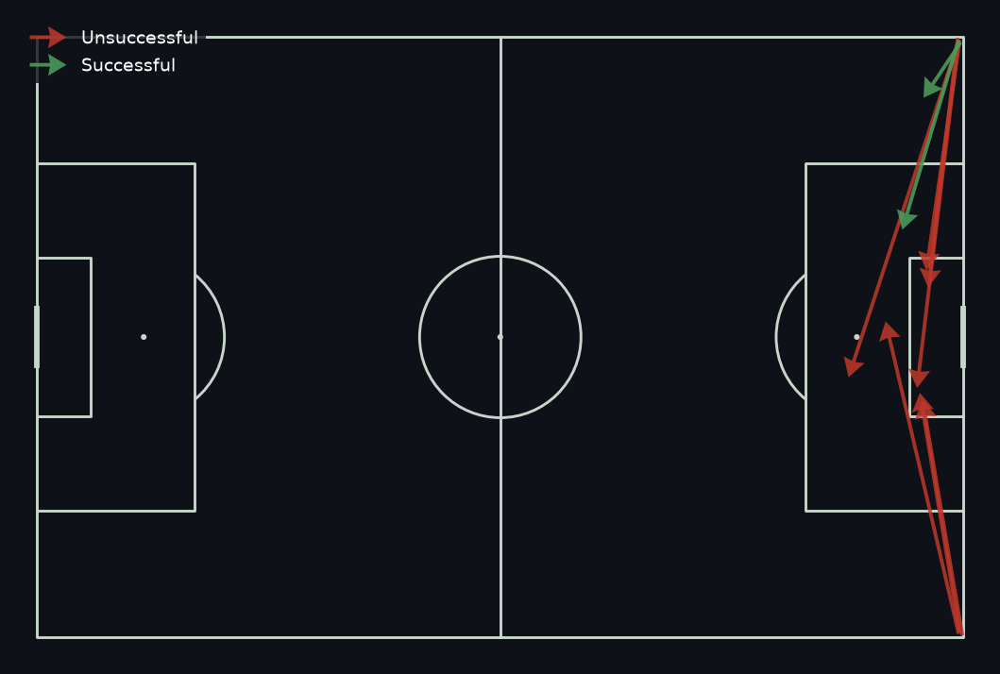

wa-setpieces
===============

**Set-piece metrics and pitch visualizations for Opta / Stats Perform F24
event data**, built on `pandas <https://pandas.pydata.org>`_ and
`mplsoccer <https://mplsoccer.readthedocs.io>`_.

Point it at an F24 match export and get: penalty, kick-off, free-kick,
corner, throw-in and goal-kick detection; team/player attempt and success
rates; second-phase shot detection for corners and free kicks; possession
retention; pitch zones/thirds/channels; and a grid-based Expected Threat
(xT) model -- all as tidy DataFrames, plus ready-made pitch plots.

.. code-block:: python

   from wa_setpieces import load_events, set_piece_summary
   from wa_setpieces.viz.plots import plot_delivery_map
   from wa_setpieces import delivery_locations

   match = load_events("match.json")
   set_piece_summary(match.events)

   corners = delivery_locations(match.events, "corner")
   plot_delivery_map(corners, title="Corner deliveries")

See the :ref:`gallery` for the full set of plots (delivery maps, zone
heatmaps, second-phase sequences, xT grids) with source code for each.

Install
-------

.. code-block:: bash

   pip install wa-setpieces          # core package
   pip install "wa-setpieces[viz]"   # + matplotlib/mplsoccer for the plotting helpers

.. toctree::
   :maxdepth: 2
   :caption: Contents

   installation
   quickstart
   gallery/index
   advanced
   qualifiers
   api
   changelog
