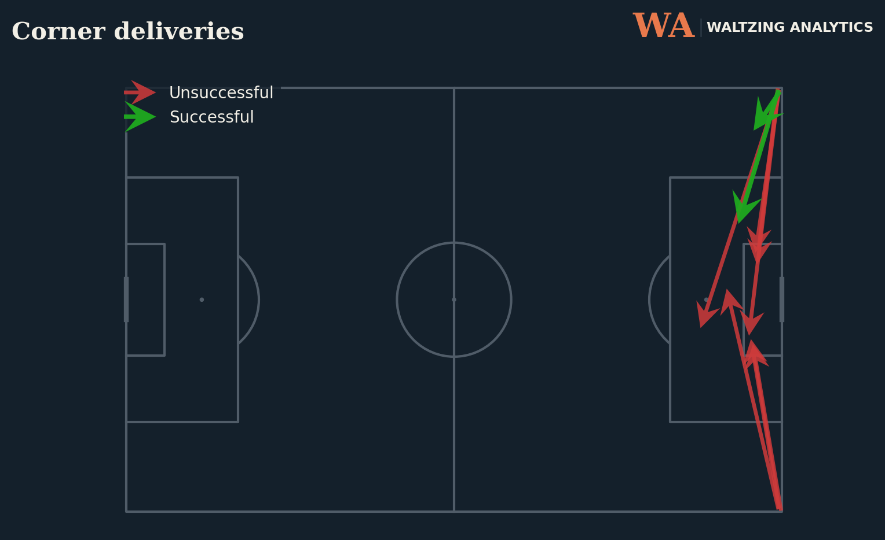

wa-setpieces
===============

**Set-piece analytics for football, in pandas.** Point it at an Opta
match export (or StatsBomb open data, via an adapter) and get every
corner, free kick, throw-in, penalty, goal kick and kick-off tagged,
measured and rated -- as tidy DataFrames, plus pitch plots built on
`mplsoccer <https://mplsoccer.readthedocs.io>`_.

.. code-block:: python

   from wa_setpieces import load_events, set_piece_summary
   from wa_setpieces.viz.plots import plot_delivery_map
   from wa_setpieces import delivery_locations

   match = load_events("match.json")
   set_piece_summary(match.events)

   corners = delivery_locations(match.events, "corner")
   plot_delivery_map(corners, title="Corner deliveries")

That one call already answers "how many, how successful, who took them" --
:func:`~wa_setpieces.set_piece_summary` returns attempts, success rate,
shots and goals for every set-piece type, per team, in one table. Everything
past that -- second phases, retention, an xT value model, benchmarked
0-100 ratings, routine taxonomies, defensive scouting, season form, HTML
reports, CSV/Excel export -- is one function call away. The
:doc:`quickstart` walks through your first match end to end; past that,
pick a reference page below.

- :doc:`quickstart` -- load a match, get a summary table and a plot on
  screen in five minutes.
- :doc:`gallery/index` -- every plot this package makes, with the source
  that made it.
- :doc:`categories` -- corner, free kick, throw-in, penalty, goal kick,
  kick-off: pick yours, see what's available.
- :doc:`value_models` -- xT, added value, shot value, ratings: pick one,
  see what it measures and how to compute it.
- :doc:`by_metric` -- counts, delivery locations, shot/goal linking,
  zones: pick one, see how to pull it.
- :doc:`by_phase` -- second phases, retention, outcomes, aerial duels:
  pick one, see what it detects.
- :doc:`by_routine` -- routine taxonomy, data-driven clusters, long
  throws, penalty placement: pick one, see how to compute it.
- :doc:`by_report` -- HTML reports, CSV/Excel export, the command line:
  pick one, see how to produce it.

Why this package
-----------------

Event-feed set-piece analysis means re-deriving the same handful of hard
things on every project: which qualifier actually means "in-swinger" and
not something else entirely, whether a defensive clearance travelled far
enough to count as "cleared," how to fit an xT model without a season's
worth of matches lying around. ``wa_setpieces`` does that derivation once,
with its reasoning written down next to the code -- see each reference
page's callouts for what's a verified fact about the feed versus a
tunable heuristic.

Install
-------

.. code-block:: bash

   pip install wa-setpieces          # core package
   pip install "wa-setpieces[viz]"   # + matplotlib/mplsoccer for the plotting helpers

See :doc:`installation` for the full set of optional extras.

.. toctree::
   :maxdepth: 3
   :caption: Contents
   :hidden:

   installation
   quickstart
   categories
   value_models
   by_metric
   by_phase
   by_routine
   by_report
   gallery/index
   changelog
